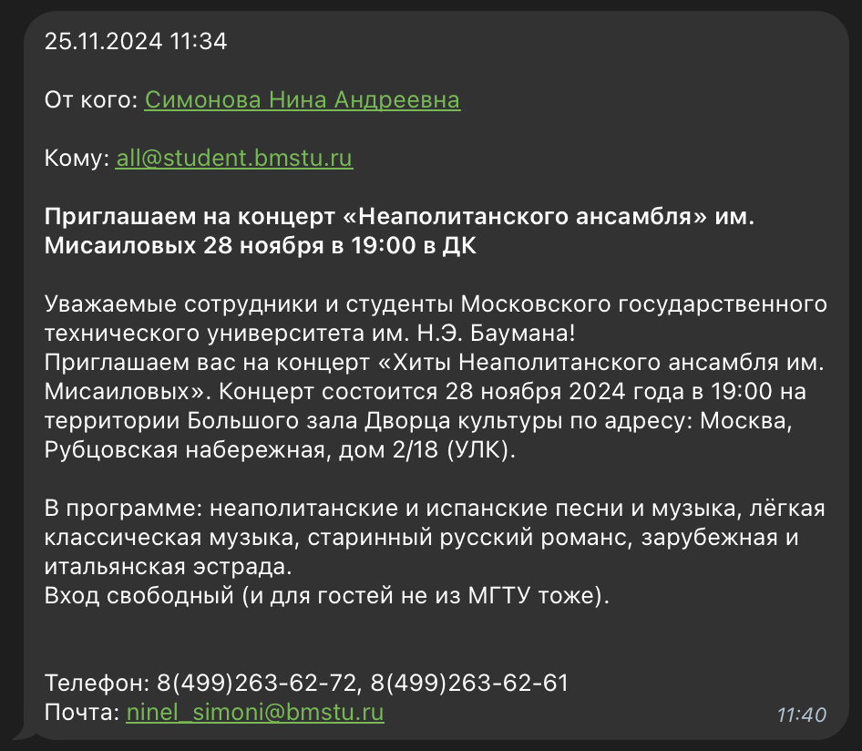

# Samowarium

Клиент [Самовара](https://student.bmstu.ru/) внутри телеги.



## Для разработки

- Переименовать `.env.example` -> `.env` и выставить токен для бота.

- Использовать python3.12 и выше.

- Установить зависимости:

```bash
pip install -r requirements.txt
```

- Запустить бота:

```bash
python3 ./src/samowarium.py
```

- Создать миграцию:

```bash
yoyo new --sql -m "migration name"
```

## Для работы с Docker

- Собрать образ:

```bash
docker compose build
```

- Или получить из регистра:

```bash
docker compose pull
```

- Запустить сервис (не забыть создать `.env` файл с переменными):

```bash
docker compose up -d
```

- Остановить сервис:

```bash
docker compose down
```
